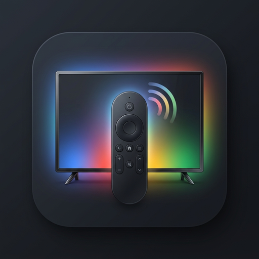
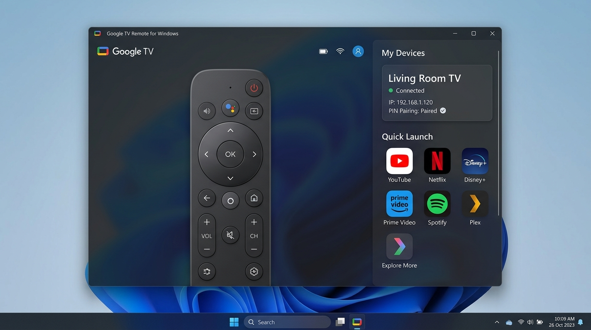

<p align="center">
  
</p>

# <p align="center">Google TV Remote for Windows 📺 🎛️</p>

<p align="center">
  <a href="LICENSE"></a>
  <a href="https://www.python.org/"></a>
  <a href="https://www.microsoft.com/windows"></a>
  <a href="https://github.com/MahmoudxFawzy/google-tv-remote-windows/releases"></a>
  <a href="https://github.com/MahmoudxFawzy/google-tv-remote-windows/releases/latest"></a>
  <a href="https://github.com/MahmoudxFawzy/google-tv-remote-windows/stargazers"></a>
</p>

<p align="center">
  A lightweight, modern, native Windows desktop remote control app for <b>Google TV</b> and <b>Android TV</b> devices. Control your TV directly from your computer over Wi-Fi with keyboard hotkeys, automatic device discovery, custom app launchers, and direct text input.
</p>

> [!TIP]
> ### ⚡ Quick Download (No Python Required)
> Want to use the remote right away without installing Python or cloning code?
>
> 🚀 **[⬇️ Download Standalone Portable Windows App (`GoogleTVRemote.exe` v2.0)](https://github.com/MahmoudxFawzy/google-tv-remote-windows/releases/latest)**
>
> *Single standalone executable — just download and double-click to run!*

<p align="center">
  
</p>

---

## 📦 Version History

| Version | Status | Highlights | Source Entrypoint |
| :--- | :---: | :--- | :--- |
| **v2.0** | 🚀 **Current Release** | Premium Fluent Dark Theme, anti-aliased high-DPI remote, balanced 3×2 streaming grid, sub-200ms instant boot, custom app icon & taskbar branding. | [`main.py`](main.py) |
| **v1.0** | 📦 *Previous Update* | Classic light-mode Tkinter layout with listbox sidebar. Preserved for backward compatibility. | [`legacy_v1/main_v1.py`](legacy_v1/main_v1.py) |

---

## 🌟 Key Features (v2.0)

*   🎨 **Modern Fluent Dark UI**: Ergonomic anti-aliased physical remote with circular D-Pad, smooth volume/channel rockers, and hover feedback.
*   ⚡ **Instant Startup**: Pre-cached high-DPI raster assets with lazy background networking (< 150ms cold boot).
*   🔍 **Automatic Device Discovery**: Auto-scans and lists Google TV / Android TV devices on your local network using mDNS (Zeroconf).
*   🌐 **Manual IP Fallback**: Direct connection option for hidden networks or stubborn network setups.
*   🔒 **Secure Pairing Flow**: Standard PIN-based pairing protocol (uses the exact same API and security protocol as Google's official Android/iOS Google TV apps).
*   ⌨️ **Full Keyboard Hotkeys**: Navigate your TV instantly using your PC keyboard (arrow keys, Backspace, Enter, Space, and more) with an in-app legend overlay (`F1`).
*   📝 **Direct Text Input**: Type search queries, passwords, and URLs on your PC and send them directly to the TV input fields.
*   🚀 **Quick Launch Streaming Grid**: Launch preloaded apps (YouTube, Netflix, Prime Video, Disney+, Spotify, Plex) or custom package IDs.
*   📦 **Single File Build**: Bundle the entire application into a standalone Windows Executable (`.exe`) with custom `.ico` branding.

---

## 📋 System Requirements

*   **Operating System**: Windows 10 or Windows 11.
*   **Python**: Version 3.10 or newer *(only required if running from source)*.
*   **Network**: Both the Windows PC and the Google TV / Android TV must be connected to the same Wi-Fi / LAN network.

---

## 🚀 Quick Start & Installation

### Option A: Standalone Portable App *(Recommended)*

1. Head to the [**Latest Releases**](https://github.com/MahmoudxFawzy/google-tv-remote-windows/releases/latest) page.
2. Download **`GoogleTVRemote.exe`**.
3. Double-click to launch — no installation, Python environment, or terminal commands needed.

---

### Option B: Run from Source *(Developers)*

1. Clone this repository:
   ```powershell
   git clone https://github.com/MahmoudxFawzy/google-tv-remote-windows.git
   cd google-tv-remote-windows
   ```

2. Install dependencies:
   ```powershell
   python -m pip install -r requirements.txt
   ```

3. Start the application:
   ```powershell
   python main.py
   ```

---

## 🔒 Pairing and Connection Guide

1.  **Discover**: Click the **Discover** button to scan for TVs on your network. Alternatively, type your TV's local IP address manually.
2.  **Connect**: Select your device and click **Connect**.
3.  **Start Pairing**: If this is your first time connecting to the device, click **Start Pairing**. A 6-character authentication PIN will pop up on your TV screen.
4.  **Submit PIN**: Enter the PIN into the desktop app and click **Submit PIN**.
5.  **Enjoy**: Once paired, your client certificates are securely saved in the local `certs/` directory, meaning you only need to pair your TV once!

---

## ⌨️ Keyboard Hotkeys Legend

Control your TV like a power user. Press `F1` inside the app to toggle the hotkey legend:

| Remote Button | PC Keyboard Hotkey | Tkinter Event |
| :--- | :--- | :--- |
| **Power** | `P` | Toggle TV power state |
| **Mute** | `M` | Mute/unmute TV audio |
| **Home** | `H` | Go to TV Home screen |
| **Back** | `Backspace` | Go back |
| **OK / Select** | `Enter` | Select active element |
| **D-Pad Up/Down/Left/Right** | `Arrow Keys` | Move navigation cursor |
| **Play / Pause** | `Space` | Toggle media playback |
| **Rewind** | `J` | Rewind media |
| **Fast Forward** | `L` | Fast-forward media |
| **Volume Up / Down** | `]` / `[` | Adjust TV volume |
| **Channel Up / Down** | `PageUp` / `PageDown` | Switch channels |

---

## 🛠️ App Configuration (`tv_apps.json`)

You can edit or extend the quick-launch sidebar by editing the `tv_apps.json` file in the application directory. It maps app names to their Android package identifier:

```json
[
  {
    "name": "YouTube",
    "app_id": "com.google.android.youtube.tv"
  },
  {
    "name": "Netflix",
    "app_id": "com.netflix.ninja"
  }
]
```

Add any custom app by looking up its Android Package Name (e.g., from the Google Play Store URL) and appending it to the list.

---

## 📦 Building a Standalone EXE

You can compile the application into a single `.exe` file that runs on any Windows machine without needing Python installed.

1.  Install PyInstaller:
    ```powershell
    python -m pip install pyinstaller
    ```
2.  Run the build script:
    ```powershell
    pyinstaller --noconfirm --windowed --onefile --name GoogleTVRemote main.py
    ```
3.  Your compiled executable will be located in the `dist/` directory: `dist/GoogleTVRemote.exe`.

---

## 🔧 Troubleshooting

*   **TV Not Discovered**: Ensure that your TV is powered on, connected to the same network, and mDNS/Zeroconf is not blocked by your router's client isolation settings. Try connecting manually by entering the TV's IP address.
*   **Connection Refused**: Check if your PC's firewall blocks UDP port `5353` (for Zeroconf) or TCP port `6466` / `6467` (used by the Google TV pairing protocol).
*   **Re-pairing Needed**: If you reset your TV or wish to pair fresh, delete the files inside the `certs/` directory and reconnect.

---

## 📄 License

This project is licensed under the MIT License - see the [LICENSE](LICENSE) file for details.
